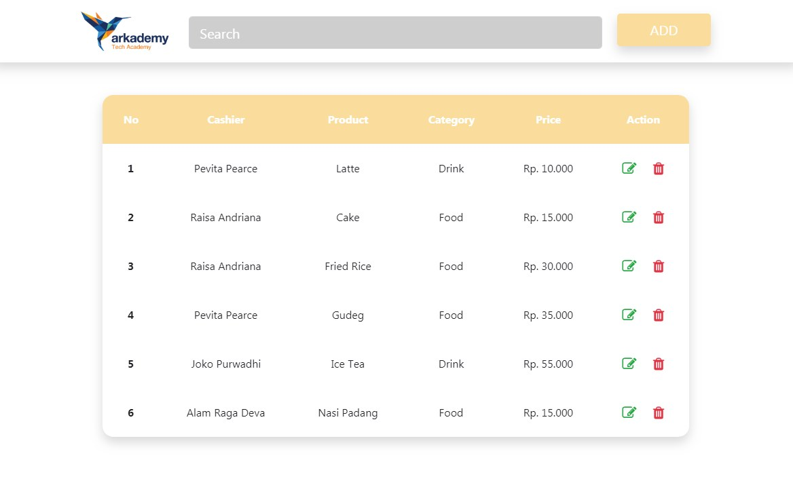
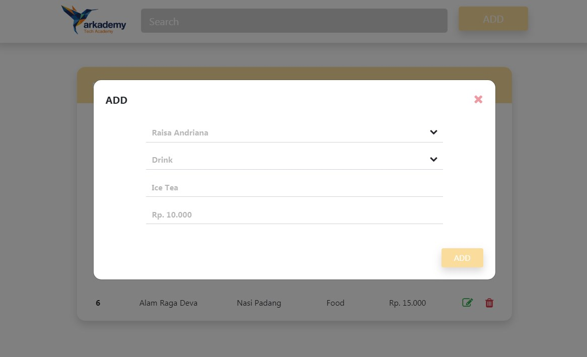
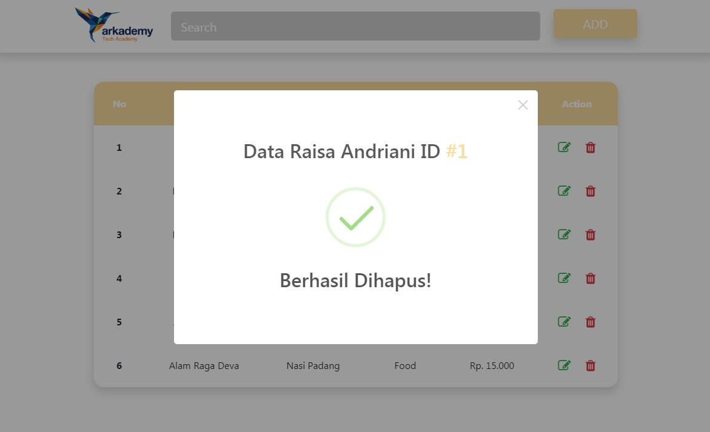
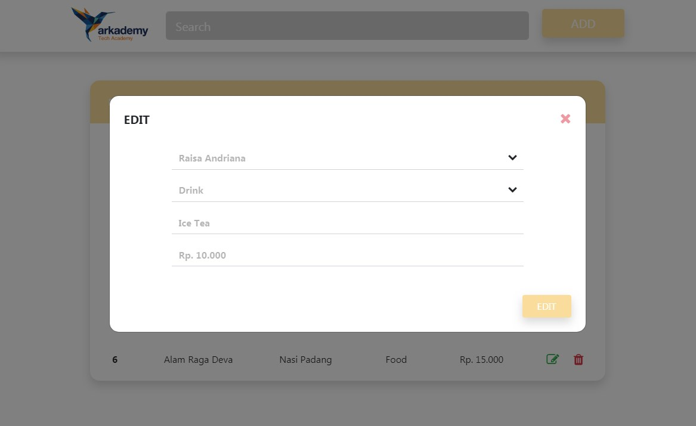

# Arkademy Bootcamp Batch 4

_Soal No. 1 - 5 bisa langsung di jalankan di https://es6console.com/_

## Soal No. 1
Kegunaan JSON pada REST API adalah sebagai format untuk mengirim (sending) dan meminta (requesting) data pada REST API. Selain JSON format data transfer bisa berupa XML (eXtensible Markup Language) dan plain text, tetapi format data JSON lebih populer karena berukuran ringan dan formatnya lebih mudah untuk dibaca dan dimengerti.

## Soal No. 2
Format username: harus diawali dari huruf kecil, tidak di mengandung huruf besar dan spesial karakter kecuali "_" dengan panjang 5-12 karakter.

Format password: merupakan kombinasi dari 5 huruf besar, mengandung angka maximal satu karakter, dan karakter spesial maximal satu karakter dengan panjang total 7 karakter.

## Soal No. 3
Soal No. 3 merupakan fungsi untuk menghitung jumlah kata dalam satu kalimat dan yang di input adalah hanya sebuah kata tidak berupa nomor.

## Soal No. 4
Soal No. 4 adalah function untuk mencetak gambar, yang mempunyai sebuah parameter sebagai panjang lebar/tinggi gambar. Parameter harus merupakan angka dan merupakan bilangan ganjil.

## Soal No. 5
Soal No. 5 merupakan deret bilangan angka berupa x dan y yang bertipe data number dengan syarat x > y. f.	Memberikan keluaran berupa array yang berisi deret bilangan dengan ketentuan yang telah diberikan dan panjang deret bilangan tersebut.

# Penyelesaian Soal No. 6 ada di folder soal6
## Soal No. 6A
Soal No. 6A meliputi pembuatan database dan query.

## Soal No. 6B
Soal No. 6B dikerjakan menggunakan framework bootstrap. Berikut Screenshoot program yang telah dibuat :

_Homepage_

_Add Data_

_Delete Data_

_Edit Data_

## Soal No. 6C
Merupakan Website sesuai dengan mockup di figma pada point 6.B menggunakan data dinamis yang berasal dari point 6.A serta ditambahkan fitur CRUD ke database pada point 6.A.

_Penggunaan CURD_

1. Import database 6.A ke tabel baru mysql.
2. Rubah "database" pada file koneksi.php dengan nama tabel yang telah di buat di mysql. 

# Credits
## Thanks to Arkademy.

### Regards, 
#### Alam Raga Deva
